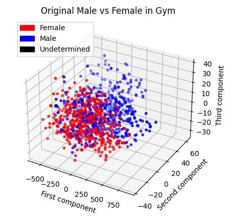
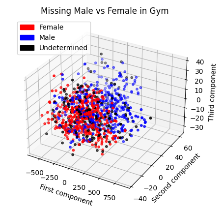
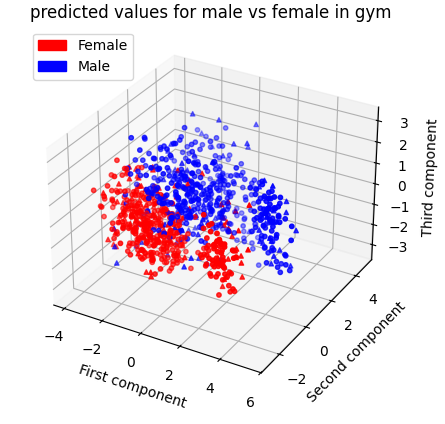

# Gym Member Classification with Neural Networks

This project applies a **Multi-Layer Perceptron (MLP)** neural network to classify gym members’ gender based on exercise tracking data. The model was trained on a Kaggle dataset and compared against a K-Nearest Neighbors (KNN) baseline.

## 📊 Dataset
- **Source:** [Kaggle – Gym Members Exercise Dataset](https://www.kaggle.com/datasets/valakhorasani/gym-members-exercise-dataset/data)  
- Preprocessed with **label encoding** for categorical values and **StandardScaler** for numerical features.  
- Dataset contained no missing features; gender labels were encoded for training.

## 🧠 Model Architecture
- **Type:** Fully-connected feed-forward neural network (MLP)  
- **Hidden Layers:** 2 (64 and 32 nodes)  
- **Activation:** ReLU  
- **Loss Function:** Cross-Entropy Loss  
- **Optimizer:** Adam  
- **Iterations:** 500  

## ⚖️ Comparative Analysis
- **KNN Model (baseline):** Best accuracy at k=10 → ~77%  
- **Neural Network:** Achieved **93.4% accuracy**, **95% precision**, **92% recall**, and **93% F1 score**  
- Demonstrated that neural networks outperform KNN on this dataset, though KNN trains faster on smaller datasets.

## 📈 Results & Visualization
The model was evaluated using **accuracy, precision, recall, and F1-score** from scikit-learn’s metrics library.  

**Metrics Output:**
Accuracy = 93.4%  
Precision = 95.2%  
Recall = 91.7%  
F1 Score = 93.4%  

**PCA Visualizations:**  
Below are the 3D PCA plots generated during training and prediction:  

- **Original Male vs Female in Gym**  

- **Data with Missing Values**  

- **Predicted vs Actual (Triangles = Predicted)**  

> To regenerate plots, run `python NN.py`. Figures will appear in the `images/` directory (or can be saved manually from Matplotlib).

## 📚 Libraries Used
- `scikit-learn` (MLPClassifier, metrics, preprocessing, PCA)  
- `numpy`  
- `pandas`  
- `matplotlib`  

---

### 🔗 Link
Source code (`NN.py`) and visualizations are included in this repository.
